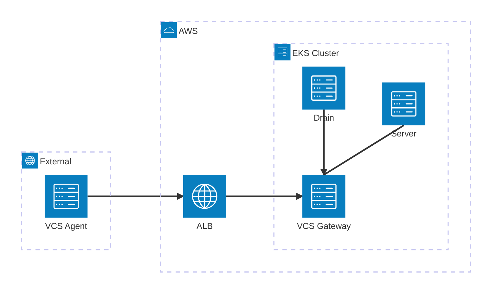

# With VCS Gateway Example

This example demonstrates how to deploy Spacelift Self-Hosted on EKS with the VCS Gateway enabled.

The VCS Gateway allows you to connect [remote VCS agents](https://docs.spacelift.io/concepts/vcs-agent-pools.html) to Spacelift, enabling integration with VCS providers that are not directly accessible from the Spacelift server.

## Architecture

The VCS Gateway service exposes two listeners:

- **gRPC (port 1984)** - External endpoint for [remote VCS Agents](https://docs.spacelift.io/concepts/vcs-agent-pools.html), exposed via an Application Load Balancer
- **HTTP (port 1985)** - Internal endpoint for Spacelift services (server, drain), accessed via [pod IP addresses](https://kubernetes.io/docs/concepts/services-networking/dns-pod-service/#pods) within the EKS cluster



| Connection                    | Protocol | Port | Path                                                  |
| ----------------------------- | -------- | ---- | ----------------------------------------------------- |
| VCS Agent → ALB → VCS Gateway | gRPC     | 1984 | `vcs-gateway.example.com:443` (TLS terminated at ALB) |
| Server → VCS Gateway          | HTTP     | 1985 | `http://192.168.1.123:1985` (pod IP address)          |
| Drain → VCS Gateway           | HTTP     | 1985 | `http://192.168.1.123:1985` (pod IP address)          |

## Prerequisites

- An ACM certificate for the VCS Gateway domain (e.g., `vcs-gateway.mycorp.io`) - this must be **separate from the server certificate** as the VCS Gateway runs on its own domain and load balancer
- DNS configuration to point the VCS Gateway domain to the created load balancer

## Usage

```hcl
module "spacelift_eks_selfhosted" {
  source = "github.com/spacelift-io/terraform-aws-eks-spacelift-selfhosted"

  # Other variables...

  # VCS Gateway configuration
  vcs_gateway_domain  = "vcs-gateway.example.com"
  vcs_gateway_acm_arn = "arn:aws:acm:us-east-1:123456789012:certificate/abc123"
}
```

## Inputs

| Name                | Description                                                            | Type   | Required |
| ------------------- | ---------------------------------------------------------------------- | ------ | -------- |
| vcs_gateway_domain  | The domain for the VCS Gateway external endpoint, **without** protocol | string | yes      |
| vcs_gateway_acm_arn | AWS Certificate Manager ARN for the VCS Gateway certificate            | string | yes      |

## Next Steps

After deploying the infrastructure:

1. [Create a VCS Agent Pool](https://docs.spacelift.io/self-hosted/latest/concepts/vcs-agent-pools.html#create-the-vcs-agent-pool) in the Spacelift UI
2. [Configure direct network access](https://docs.spacelift.io/self-hosted/latest/concepts/vcs-agent-pools.html#configure-direct-network-access) on your private workers using the `SPACELIFT_PRIVATEVCS_MAPPING_*` environment variables
